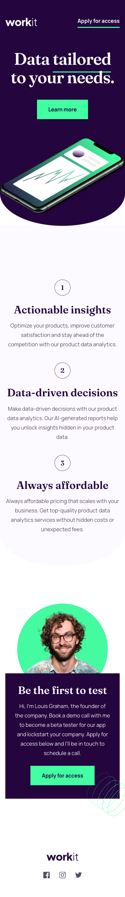
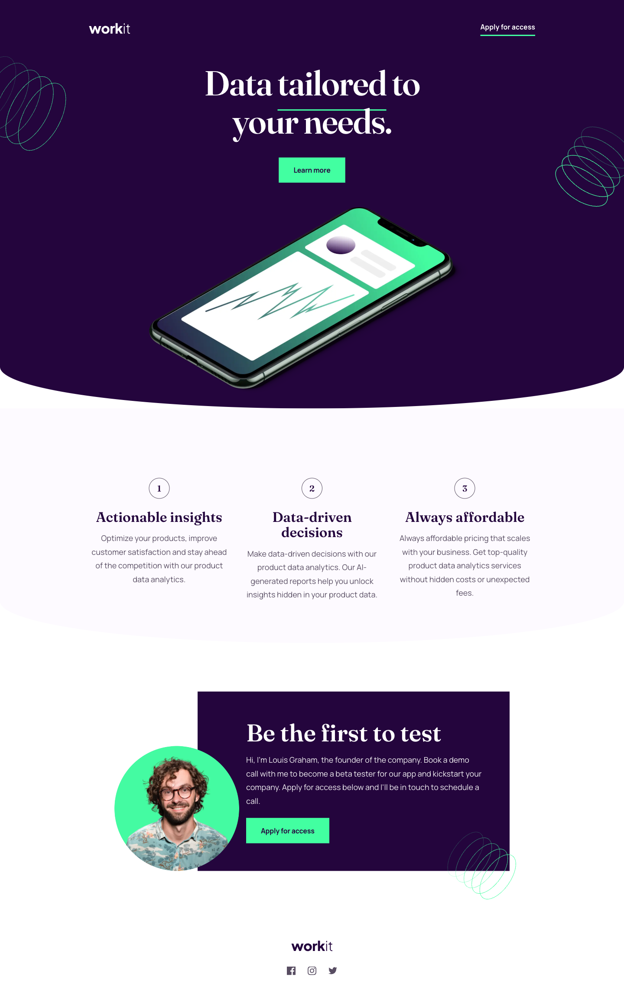

# Frontend Mentor - Workit landing page solution

This is a solution to the [Workit landing page challenge on Frontend Mentor](https://www.frontendmentor.io/challenges/workit-landing-page-2fYnyle5lu).

## Table of contents

- [Overview](#overview)
  - [The challenge](#the-challenge)
  - [Screenshots](#screenshots)
- [My process](#my-process)
  - [Built with](#built-with)
  - [Getting started](#getting-started)
- [Author](#author)

## Overview

### The challenge

Users should be able to:

- View the optimal layout for the interface depending on their device's screen size
- See hover and focus states for all interactive elements on the page

### Screenshots

**Mobile — 375px**



**Desktop — 1440px**



## My process

### Built with

- Semantic HTML5 markup
- CSS custom properties (colors, gradients, typography, spacing parameterized)
- Flexbox and CSS Grid
- Mobile-first responsive workflow
- [Vite](https://vitejs.dev/) — dev server and build tool
- Local variable fonts: **Fraunces** & **Manrope**

### Getting started

```bash
npm install
npm run dev      # http://localhost:5173
npm run build    # production build to /dist
```

Project structure:

```
src/
  index.html
  data.json
  styles/
    main.css
    _variables.css   (design tokens)
    _fonts.css
    _reset.css
    _components.css
    _layout.css
assets/
  images/  fonts/
screenshots/
```

## Author

- LinkedIn — [](https://www.linkedin.com/in/gustavosanchezgalarza/)
- GitHub — [](https://github.com/gusanchefullstack)
- Hashnode — [](https://hashnode.com/@gusanchedev)
- X — [](https://x.com/gusanchedev)
- Bluesky — [](https://bsky.app/profile/gusanchedev.bsky.social)
- freeCodeCamp — [](https://www.freecodecamp.org/gusanchedev)
- Frontend Mentor — [](https://www.frontendmentor.io/profile/gusanchefullstack)
